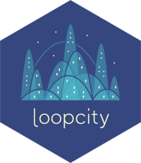

<!-- README.md is generated from README.Rmd. Please edit that file -->

# loopcity <a href="http://www.sarmapar.com/loopcity/"></a>

<!-- badges: start -->

<!-- badges: end -->

While chromatin loops identified from Hi-C data are typically analyzed individually, growing evidence suggests they often organize into highly interconnected multi-loop communities that coordinate gene regulation, yet existing methods for detecting these structures have significant limitations including dependence on imprecise loop callers or requirements for specialized sequencing techniques. Loopcity addresses this gap as an R package designed to identify multi-loop communities from standard Hi-C chromatin interaction data, revealing higher-order patterns of 3D genome organization beyond individual loops.

**loopcity** takes Hi-C contact matrices and existing loop calls as input, then constructs weighted interaction networks where genomic anchors serve as nodes and loops as edges. Through a five-step pipeline involving anchor merging, loop connection detection, enrichment scoring, network pruning, and community detection using clustering algorithms like Leiden, loopcity identifies densely interconnected groups of genomic loci that may coordinate gene regulation. The package is designed for compatibility with existing Bioconductor workflows and includes visualization tools to display detected communities within Hi-C contact maps, making it a valuable resource for researchers investigating chromatin architecture, gene regulation, and the functional consequences of 3D genome organization across different cell types and organisms.

## Citation

*publication coming soon*

## Installation

loopcity is currently being submitted to [Bioconductor](https://www.bioconductor.org/).

You can install the development version of loopcity from [GitHub](https://github.com/) with:

```{r installation, eval = F}
if (!requireNamespace("remotes", quietly = TRUE))
    install.packages("remotes")

remotes::install_github("sarmapar/loopcity")
```

## Overview


**Loopcity detects chromatin communities from Hi-C data.** (a) Schematic overview of the main loopcity functions. (From top to bottom) Nearby anchors are merged to create network nodes, edges are added to connect all nearby nodes, edge weights are added based on enrichment over local background, edges with low weights are removed and chromatin communities are assigned using network clustering algorithms. (b) Contact frequency map of Hi-C data from K562 cells. Loops are annotated as black diamonds. Chromatin communities derived using a naive approach—where all loops with overlapping anchors are merged into a single community without anchor refinement—are shown via colored arches, with each color representing a different community. (b) The same Hi-C map is shown and loop annotations are depicted. Loops added by loopcity are annotated as grey diamonds. Chromatin communities derived using loopcity are shown via colored arches, with each color representing a different community.


For a more detailed description of this workflow and it's individual functions, see the Getting Started tab.
