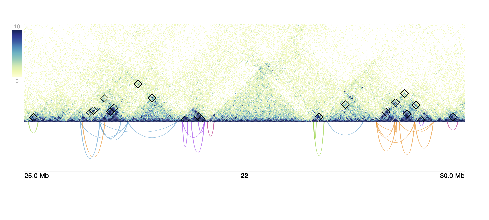

```{r, include = FALSE}
knitr::opts_chunk$set(
  collapse = TRUE,
  comment = "#>"
)
```

```{r setup, include = FALSE}
library(loopcity)
```

# Installation

This package can be installed via Github:

```{r installPackage, eval=FALSE}
if (!requireNamespace("remotes", quietly = TRUE))
    install.packages("remotes")
remotes::install_github("sarmapar/loopcity")
```

# loopcity Pipeline

While `loopcity` functions can be used in isolation, they are more powerful used in sequence. There are 4 main steps to call communities from a `.hic` file and a `GInteractions` object of loops.

## Starting with a loop file

If you have a `.txt` file of loop calls, these can be converted to a `GInteractions` object using the package `mariner`. Loopcity requires loop anchors to be binned to the same size, so loops can also be binned using `assignToBins` which accepts a loop file, BEDPE-formatted 'data.frame'-like object, or GInteractions object.

```{r preprocessLoops}
loopFile <- "data/GM12878_10KbLoops.txt"

## To read in loop file as-is, use `as_ginteractions`
loops <- read.table(loopFile) |>
    mariner::as_ginteractions()


## To bin loops to a certain size, use `assignToBins`
loops <- read.table(loopFile) |>
    mariner::assignToBins(binSize = 10e3)

```

## Step 1: Merge Loop Anchors using `mergeAnchors`

Since loop calling can be imprecise, using loop anchors as-is can lead to multiple anchors representing one biologically relevant region. By default, any duplicate loops created via this merging are dropped, but these can be kept by setting `dropDups = F`.

```{r mergingLoops}
mergedLoops <- mergeAnchors(loops)
```

In this example, since one bin is 10Kb and `pixelOverlap` is 1 by default, all loop anchors within 1 pixel or 10Kb from each other will be grouped and merged into one representative anchor. The most common or the middle-most of these anchors is chosen as the new representative position for all neighboring anchors. Increasing `pixelOverlap` to `n` means all loop anchors within `n` pixels, or `n` \* `binSize` base pairs will be merged into one position.

The output, `mergedLoops`, is a `GInteractions` object with all the same information from `loops` but with adjusted anchor positions.

```{r mergedOutput}
mergedLoops
```

## Step 2: Add connections using `connectLoopAnchors`

Since loop callers are limited to a binary classification of "loop" or "not a loop", we can instead create all possible loops and then create a threshold of what should be kept as a "true" loop based on a set of flexible parameters. The first step in this process is to create a set of all possible loops. The `connectLoopAnchors` function creates a new set of loops, connecting all anchors to every anchor within `overlapDist`. In this example, all anchors within 1Mb of each other are connected to create new loops.

```{r connectingAnchors}
connections <- connectLoopAnchors(mergedLoops, overlapDist = 1e6)
```

This results in a new `GInteractions` object, with original metadata removed and a new metadata column named "source" where all interactions that were present in the original set of loops are labeled as "original" and added loops are labeled as "added".

```{r connectionsOutput}
connections
```

## Step 3: Score original and new loops using `scoreInteractions`

These added and original connections are then scored based on the enrichment of the counts of the loop pixel compared to the local background. The shape and size of this local background can be customized using the parameters `bg` for the shape, and `bgSize`, `bgGap`, and `fgSize` for the size.

This normalizes contact counts between loop sizes, since shorter loops typically have higher raw counts. To account for noise in long range loops with low counts, a pseudocount value of 5 is added to all raw counts before calculating an enrichment score. This pseudocount value can be modified by changing the `pseudo` value.

```{r scoringLoops}
hicFile <- system.file("extdata", "GM12878_chr22.hic", package = "loopcity")

scores <- scoreInteractions(connections,
                            hicFile = hicFile)
```

This results in a new `InteractionArray` containing the scores for all interactions and metadata such as the name of the .hic file the counts came from and the number of pseudocounts added. To get just the `GInteraction` object with the new `score` column, we can run `interactions(scores)`

```{r scores}
# the `scores` object is an 'InteractionArray' containing extra metadata information
scores 
```

```{r score_interactions}
# the interactions of the `InteractionArray` gives back a `GInteractions` object
InteractionSet::interactions(scores)
```

## Step 4: Assign anchors and loop communities using `assignCommunities`

The `GInteractions` object stored inside `score` can then be used to assign communities. This function builds a network where the nodes are each loop anchor and the edge weights are the enrichment scores calculated in the previous step. By default, all loops with a score less than the median score of original loops are removed. This threshold is printed in a message and stored in the metadata of the output object in a variable called `pruningValue`. This value can be manually set by passing a value to the `pruneUnder` parameter.

This network is then passed through a clustering algorithm. The default algorithm is leiden, but other options include "fast_greedy", "walktrap", "infomap", "label_prop", or "edge_betweenness". This assigns each loop anchor to a community, and any nodes that are closely bordering a neighboring community are evaluated to determine if they should be included in both communities. If the average score of the border anchor and all anchors in the neighboring community is greater than the average score of all interactions between all the anchors in the current community, then the anchor is assigned to both the original and neighboring community. Loops are assigned to a community if both anchors of the loop are in the same community.

```{r }
communities <- assignCommunities(InteractionSet::interactions(scores))
```

To see the pruning value used to remove edges from the network, run the following code

```{r}
S4Vectors::metadata(communities)$pruningValue
```

## Full Workflow

These four functions can be combined into one step by piping the results from one function into the next. This results in the same final `GInteractions` object which contains the merged anchor locations, enrichment scores for each loop, anchor communities, and loop communities.

```{r fullWorkflow}
communities <- loops |>
    mergeAnchors() |>
    connectLoopAnchors(overlapDist = 1e6) |>
    scoreInteractions(hicFile = hicFile) |>
    InteractionSet::interactions() |>
    assignCommunities()
```

## Visualizing Communities

We also provide a function to visualize these communities using the final `GInteractions` object returned from `assignCommunities` and a .hic file. This returns a pdf of the given region(s), with each region on each page. The figure contains a heatmap of hic counts with original loops annotated by black squares and added loops annotated by grey squares and arches with their height set to the calculated enrichment score colored by their assigned community.

```{r plot, eval = F}
plotHicCommunities(pdfName = "plot.pdf", 
                   communities = communities, 
                   hicFile = hicFile,
                   norm = "NONE",
                   chroms = 22, 
                   starts = 25e6, 
                   ends = 30e6,
                   zmax = 10)
```

{width="100%"}

```{r}
devtools::session_info()
```
